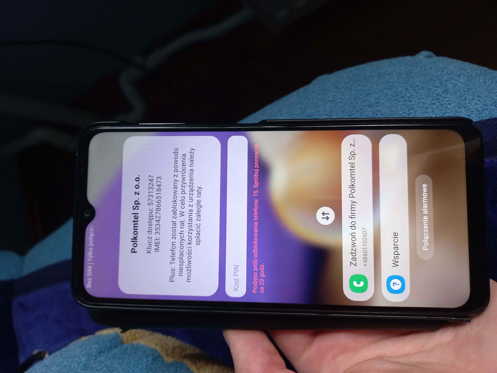

This repository contains a set of ADB commands, a MacroDroid APK package, and an
importable macro to unlock carrier-locked [Samsung] Android devices.  

The script has been successfully tested on multiple S21 and A32-series phones over a span of two years (2022-2024).

As of April 2024, the Factory Reset Protection (FRP) exploit preceding this script no longer works due to a patch that disables all non-emergency contact actions in the lock-screen dialer.

To check if your device has been patched, enter one of these codes in the lock-screen dialer: `*#0*#`, `*#011#`, `*#0228#`.

## Removal Process



Before running Knoxium, FRP must be disabled. The recommended way is to use SamFW tool, available at [samfw.com/frp](https://samfw.com/frp).

 

Once FRP is disabled, enter the ADB console and run `knoxium-main` to:

### Restart ADB and install MacroDroid  
```sh
adb kill-server
adb install macro.apk
```  

### Modify lock screen and disable KnoxGuard (kgclient)
```sh
adb shell settings put system OPTION_SCREEN_LOCK 1
adb shell pm disable-user --user 0 com.samsung.android.kgclient
adb shell pm uninstall --user 0 com.samsung.android.kgclient
```  

### Switch sensor privacy and remove Mobile Device Management (MDM)
```sh
adb shell am start -n com.android.systemui/com.android.systemui.sensorprivacy.television.TvUnblockSensorActivity
adb shell pm uninstall --user 0 com.samsung.android.mdm
adb shell pm disable-user --user 0 com.sec.enterprise.knox.cloudmdm.smdms
adb shell pm uninstall --user 0 com.sec.enterprise.knox.cloudmdm.smdms
```  

### Remove Samsung's Region-Based Configuration System (omcagent)  
```sh
adb shell pm uninstall --user 0 com.samsung.android.app.omcagent
```  

### Grant MacroDroid permissions  
```sh
adb shell pm grant com.arlosoft.macrodroid android.permission.WRITE_SECURE_SETTINGS
adb shell pm grant com.arlosoft.macrodroid android.permission.READ_PHONE_STATE
adb shell pm grant com.arlosoft.macrodroid android.permission.DUMP
adb shell settings put secure enabled_accessibility_services com.arlosoft.macrodroid/com.arlosoft.macrodroid.triggers.services.MacroDroidAccessibilityServiceJellyBean
```  

### Skip Google and Samsung Setup Wizards and mark device as provisioned  
```sh
adb shell pm disable-user --user 0 com.google.android.setupwizard
adb shell pm disable-user --user 0 com.sec.android.app.SecSetupWizard
adb shell pm enable --user 0 com.google.android.setupwizard
adb shell pm enable --user 0 com.sec.android.app.SecSetupWizard
adb shell settings put global device_provisioned 1
adb shell content insert --uri content://settings/secure --bind name:s:user_setup_complete --bind value:s:1
```  

### Final sensor switch
```sh
adb shell am start -n com.android.systemui/com.android.systemui.sensorprivacy.television.TvUnblockSensorActivity
```  

At this point, the initial lock is removed, and MacroDroid will prevent Knox from remotely re-locking the device. However, keep in mind that the lock will return after a factory reset.


## Why not just root the device?  

While rooting would make the removal process much easier, it would also make the device incompatible with certain apps, including banking. 

Instead of rooting, Knoxium removes the lock and prevents re-locking through automation, making the device de-facto indistinguishable from a regular, unlocked phone.

## Additional information

'macro-knoxium.mdr' is a MacroDroid macro backup, generated specifically for SM-A325F running a Polish-language system, it has been left in the repository intentionally.

It serves as a boilerplate configuration, preloading automation rules for this specific model and language setup. While it will work with other Samsung A32-series phones, you may need to adjust it by modifying triggers, actions, and conditions within MacroDroid for your specific model and locale. 

## Disclaimer  

**Knoxium is intended for personal use only. Do not use this script
unless you are prepared to void your device's warranty and potentially violate service agreements**.
